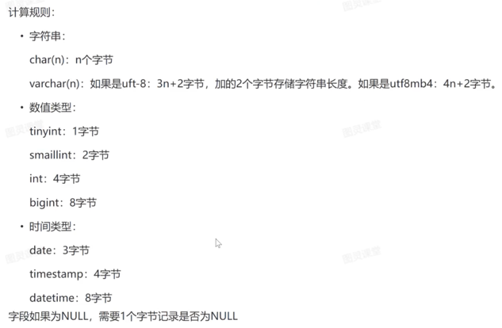

# mysql

<!-- TOC -->
* [mysql](#mysql)
  * [术语](#术语)
  * [索引失效](#索引失效)
  * [explain](#explain)
    * [id](#id)
    * [select_type](#selecttype)
      * [simple](#simple)
      * [primary](#primary)
      * [subquery](#subquery)
      * [dependent subquery](#dependent-subquery)
      * [derived](#derived)
      * [union](#union)
      * [dependent union](#dependent-union)
      * [union result](#union-result)
    * [type](#type)
      * [system](#system)
      * [const](#const)
      * [eq ref](#eq-ref)
      * [ref](#ref)
      * [fulltext](#fulltext)
      * [ref of null](#ref-of-null)
      * [range](#range)
      * [index](#index)
      * [all](#all)
    * [possible key](#possible-key)
    * [key](#key)
    * [key_len](#keylen)
    * [ref](#ref-1)
    * [rows](#rows)
    * [filter](#filter)
    * [extra](#extra)
      * [using index](#using-index)
      * [using where](#using-where)
      * [using index condition](#using-index-condition)
      * [using temporary](#using-temporary)
      * [using filesort](#using-filesort)
      * [select tables optimized away](#select-tables-optimized-away)
  * [远程权限](#远程权限)
  * [读写分离](#读写分离)
  * [查看正在执行语句](#查看正在执行语句)
  * [查看ddl](#查看ddl)
  * [时间格式化](#时间格式化)
  * [unable to load key](#unable-to-load-key)
  * [生成column](#生成column)
  * [时间](#时间)
  * [upsert](#upsert)
  * [查询隔离级别](#查询隔离级别)
  * [锁](#锁)
    * [行锁](#行锁)
    * [间隙锁](#间隙锁)
    * [表锁](#表锁)
<!-- TOC -->

## 术语

| 缩写           | 全称                                        | 含义                                          |
|--------------|-------------------------------------------|---------------------------------------------|
| derived      | Derived Table                             | 派生表                                         |
| alias        | AS                                        | 别名                                          |
| incompatible | incompatible                              | 不相容                                         |
| cast         | Convert a value to a specified datatype   | 将一个值转换为指定的数据类型                              |
| ddl          | Data Definition Language                  | 主要有CREATE，DROP，ALTER等对逻辑结构有操作的，包括表结构、视图和索引  |
| dql          | Data Query Language                       | 主要以SELECT为主                                 |
| dml          | Data Manipulation Language                | 主要包括INSERT，UPDATE，DELETE                    |
| dcl          | Data Control Language                     | 主要是权限控制能操作，包括GRANT，REVOKE，COMMIT，ROLLBACK等。 |
| b tree       | balance tree                              | 平衡树                                         |
| constraint   | constraint                                | 约束                                          |
| InnoDB       | Innovative DataBase                       | 创新数据库 ，RDBMS的存储引擎                           |
| MyISAM       | My Indexed Sequential Access Method       | 我的索引顺序访问方法，存储引擎                             |
| XA           | eXtended Architecture                     | 扩展架构   分布式事物                                |
| savepoints   | Savepoints in Database Management Systems | 数据库管理系统中的保存点 回滚                             |
| partition    |                                           | 分区                                          |
| ref          | reference                                 | 引用                                          |
| optimize     |                                           | 优化                                          |
## 索引失效
* 最左原则
* select*
* 索引里有计算
* 索引里有函数
* like%在左侧
* 隐式转换
* or两边都要索引
* 两列比较
* is not null
* <>
* not in主键走，二级索引不走
* not exist
* 除了主键排序
* 

## explain

https://www.cnblogs.com/istitches/p/17153172.html#%E4%B8%80-%E6%9F%A5%E7%9C%8Bsql%E6%89%A7%E8%A1%8C%E9%A2%91%E7%8E%87
https://dev.mysql.com/doc/refman/8.0/en/explain-output.html

### id

1. 不一样的：从大到小执行
2. 一样的：从上到下
3. null：最后执行（表示结果集，不需要使用它来执行）
4. 会自动优化语句

查看优化后语句

```sql
show
warnings;
```

### select_type

操作类型

#### simple

1. 简单select，
2. 不包括union
3. 不包括子查询

#### primary

1. 复杂查询中最外层查询
2. 使用union时id为1通常为primary

#### subquery

1. 子查询语句
2. 在select中
3. 不在from中
4. 不依赖外部语句

#### dependent subquery

1. 子查询语句
2. 在select中
3. 依赖外部语句

#### derived

1. 子查询
2. 派生表
3. 在from中
4. 从外部语句推导出来

关闭对衍生表合并优化

```sql
set
seession optimizer switch='derived_off';
```

#### union

1. 在from中
2. 在union之后
3. union前不是
4. union去重
5. union all不去重，无union result

#### dependent union

1. 在in中
2. 在union之后
3. union前不是
4. union去重
5. union all不去重，无union result

#### union result

1. union结束后

### type

1. 至少range
2. 最好ref

#### system

1. const类型特殊场景
2. 查一行
3. 需要精确engine
4. innodb不精确（all）
5. memory精确

#### const

1. 查一行
2. 用primary｜unique index
3. mysql对查询优化并转常量

#### eq ref

1. 基于primary｜unique index 进行join
2. 每个索引键值对只有一条记录
3. 被驱动的

#### ref

1. 基于非unique index join两个表｜通过二级索引（index、unique index）列与常量进行等值匹配
2. 可能存在多条匹配记录

#### fulltext

#### ref of null

#### range

1. 使用非unique index 扫描部分索引

#### index

1. 扫描整个索引
2. 一般是二级索引（index、unique index）
3. 一般使用覆盖索引（查询列都为索引列，回表查询）
   优化：缩小数据范围

#### all

1. 扫描聚簇索引树

优化：添加索引

### possible key

可能使用的索引

### key

实际使用的索引

### key_len

1. 索引记录的最大长度
2. 主要是联合索引



### ref

和key比较的（字段｜常量）

### rows

1. 行数估计值
2. 越小越好

### filter

1. 符合数据条件的查询百分比
2. rows*filter/100

### extra

1. 额外信息

#### using index

1. 通过索引

#### using where

1. 不通过索引

#### using index condition

1. 查询列不被索引覆盖
2. where条件内是索引范围查找
3. 回表找到所有符合条件数据行

#### using temporary

1. 用临时表

优化：添加索引

#### using filesort

1. 包含orderby
2. 没利用索引
3. 数据少从内存排序
4. 数据多从磁盘排序

优化：索引排序

#### select tables optimized away

1. 使用聚合函数访问索引

## 远程权限

1. 进入mysql库
2. 进入user表
3. 将root用户的host由localhost改成%
4. 刷新数据库缓存
5. 打开服务商安全组端口
6. 打开系统防火墙端口
7. 修改mysql.cnf的bind-address为0.0.0.0
8. 重启mysql

## 读写分离

在常见的读写分离架构中，通常会有一个主数据库（Master）和一个或多个从数据库（Slave）。主数据库负责处理写操作（INSERT、UPDATE、DELETE等），并将数据的变化同步到从数据库。从数据库主要处理读操作（SELECT等），从而分担了主数据库的读负载。

## 查看正在执行语句

```sql
select *
from information_schema.PROCESSLIST
where info is not null
```

```sql
-- 1、设置
SET
GLOBAL log_output = 'TABLE';  SET
GLOBAL general_log = 'ON';
SET
GLOBAL log_output = 'TABLE';  SET
GLOBAL general_log = 'OFF';

-- 2、查询
SELECT *
from mysql.general_log
ORDER BY event_time DESC
-- 3、清空日志记录
    truncate table mysql.general_log;

```

## 查看ddl

```sql
SHOW
CREATE TABLE TradeMarketStatistic;

```

## 时间格式化

## unable to load key

```
ssh-keygen -p -N "" -m pem -f /path/to/file
```

## 生成column

```sql
select GROUP_CONCAT(concat('`', COLUMN_NAME, '`'))
from information_schema.`COLUMNS`
where TABLE_SCHEMA = 'enjoyfood_assets'
  and TABLE_NAME = 'redeem';
```

## 时间

在使用 Gorm（Go语言的一个ORM库）向 MySQL 数据库插入 timestamp 值时，可能会遇到时区的问题。Gorm 默认会将时间戳按照本地时区进行处理，而
MySQL 的 timestamp 类型是无时区概念的，因此可能导致插入的时间值与预期不符

```shell
time.Now().UTC()
```

## upsert

```sql
INSERT INTO your_table (id, name, value)
VALUES (1, 'example', 'new_value') ON DUPLICATE KEY
UPDATE name =
VALUES (name), value =
VALUES (value);
```

## 查询隔离级别

| 隔离级别             | 脏读  | 不可重复读 | 幻读  |
|------------------|-----|-------|-----|
| Read Uncommitted | √   | √     | √   |
| Read Committed   | ×   | √     | √   |
| Repeatable Read  | ×   | ×     | √   |
| Serializable     | ×   | ×     | ×   |

```mysql
SELECT @@tx_isolation;
```

## 锁
```mysql
show status like 'innodb_row_lock%';
```
### 行锁

### 间隙锁

### 表锁
