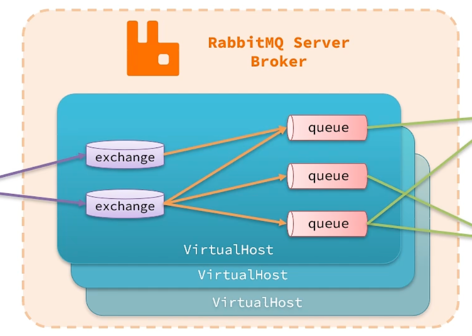

# rabbitmq

<!-- TOC -->
* [rabbitmq](#rabbitmq)
  * [术语](#术语)
  * [架构](#架构)
  * [生产者可用性](#生产者可用性)
  * [消息可用性](#消息可用性)
  * [消费可用性](#消费可用性)
  * [实现幂等](#实现幂等)
<!-- TOC -->

## 术语

| 缩写           | 全称                    | 含义                     |
|--------------|-----------------------|------------------------|
| publisher    | Derived Table         | 发送者                    |
| consumer     | consumer              | 消费者                    |
| queue        | queue                 | 队列，存储消息                |
| exchange     | exchange              | 交换机，路由消息               |
| virtual-host | virtual-host          | 虚拟主机，数据隔离              |
| fanout       | fan-out               | publish/subscribe，扇出广播 |
| direct       | direct                | routing，精确匹配路由键        |
| topic        | topic                 | topic，模糊匹配路由键          |
| ACK          | Acknowledge character | 确认字符，表示接收到的字符无错误       |
| correlate    |                       | 相互关联                   |
| manual       |                       | 手动模式                   |
| reject       |                       | 拒绝                     |
| nack         |                       | 错误                     |
| dlx          | dead letter exchange  | 死信交换机                  |
|              | delay exchange        | 延迟交换机                  |

## 架构

## 生产者可用性

* 重连机制
* 确认机制

## 消息可用性

* 交换机持久化
* 队列持久化
* 消息持久化
* 惰性队列

## 消费可用性

* 丢弃消息
* 重新入队
* 投到指定交换机
* 重试机制

## 实现幂等
* 把幂等与不幂等操作锁在一起
  * 天生幂等
  * 版本号
  * 状态

## 延时消息
* 死信交换机
* 延迟消息插件