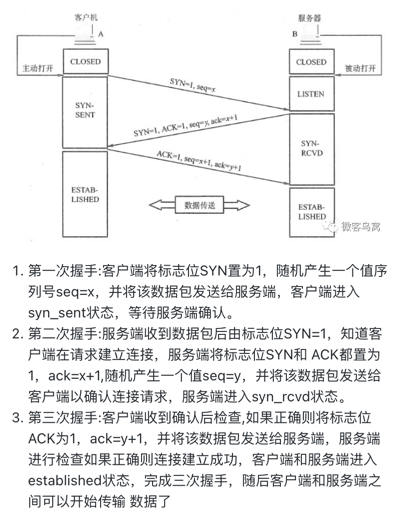
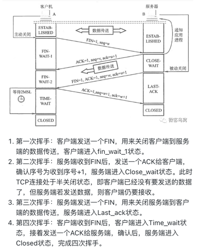

# 面试题

<!-- TOC -->
* [面试题](#面试题)
  * [go](#go)
    * [协程内存](#协程内存)
    * [为什么叫GO111MODULE](#为什么叫go111module)
    * [gmp](#gmp)
      * [单进程（没调度器）](#单进程没调度器)
      * [多进程并发](#多进程并发)
      * [多线程并发](#多线程并发)
      * [协程并发](#协程并发)
        * [N:1](#n--1)
        * [1:1](#1--1)
        * [M:N](#m--n)
    * [channel状态](#channel状态)
    * [结构体比较](#结构体比较)
    * [make和new区别](#make和new区别)
    * [时间函数增加一天](#时间函数增加一天)
    * [goroutine内跑goroutine](#goroutine内跑goroutine)
    * [判断错误类型](#判断错误类型)
    * [recover](#recover)
    * [控制goroutine关闭](#控制goroutine关闭)
    * [map要注意什么](#map要注意什么)
    * [数组和切片区别](#数组和切片区别)
    * [golang中的对象池](#golang中的对象池)
    * [golang内存逃逸懂吗](#golang内存逃逸懂吗)
    * [往缓冲满了的channel发送数据会怎么样](#往缓冲满了的channel发送数据会怎么样)
    * [哪些引用类型哪些是值类型](#哪些引用类型哪些是值类型)
    * [如何解决跨域](#如何解决跨域)
    * [字符串转切片如何不拷贝内存](#字符串转切片如何不拷贝内存)
    * [Goroutine和线程的区别？](#goroutine和线程的区别)
    * [map底层](#map底层)
    * [channel底层](#channel底层)
  * [redis](#redis)
    * [常用类型](#常用类型)
    * [持久化](#持久化)
    * [集群](#集群)
    * [哨兵](#哨兵)
  * [linux](#linux)
    * [442是什么](#442是什么)
    * [linux bridge](#linux-bridge)
    * [proc目录内是什么](#proc目录内是什么)
    * [查看端口命令](#查看端口命令)
    * [查看日志最新内容](#查看日志最新内容)
    * [搜寻字符串](#搜寻字符串)
  * [tcp握手挥手](#tcp握手挥手)
    * [三次握手](#三次握手)
    * [四次挥手](#四次挥手)
  * [etcd](#etcd)
  * [mysql](#mysql)
    * [索引](#索引)
    * [主键索引调优](#主键索引调优)
    * [唯一索引调优](#唯一索引调优)
    * [普通索引调优](#普通索引调优)
    * [全文索引调优](#全文索引调优)
    * [组合索引调优](#组合索引调优)
    * [空间索引调优](#空间索引调优)
    * [哈希索引调优](#哈希索引调优)
  * [数据结构和算法](#数据结构和算法)
  * [其他](#其他)
    * [在浏览器中输入www.baidu.com后执行的全部过程？](#在浏览器中输入wwwbaiducom后执行的全部过程)
    * [乐观锁、互斥锁、读写锁、分布式锁](#乐观锁互斥锁读写锁分布式锁)
      * [乐观锁（Optimistic Locking）：](#乐观锁optimistic-locking)
      * [互斥锁（Mutex Lock）：](#互斥锁mutex-lock)
      * [读写锁（Read-Write Lock）：](#读写锁read-write-lock)
      * [分布式锁：](#分布式锁)
      * [悲观锁（Pessimistic Locking）：](#悲观锁pessimistic-locking)
    * [Elasticsearch用于什么](#elasticsearch用于什么)
    * [Golang解决TCP粘包拆包问题](#golang解决tcp粘包拆包问题)
<!-- TOC -->

## go

### 协程内存

每个协程至少需要消耗2KB 的空间，那么假设计算机的内存是2GB，那么至多允许2GB/2KB = 1M 个协程同时存在。 一个Goroutine消耗多少CPU
实际上跟执行函数的逻辑有着很大的关系，如果执行的函数是CPU密集型的计算，并且持续的时间很长，那么这个时候CPU就会优先到达瓶颈。

### 为什么叫GO111MODULE

GO111MODULE 的命名中的“111”并不是版本号或者日期，而是环境变量的名称。这个命名方式是因为在 Go 语言的历史中，之前使用的
GOPATH 依赖管理方式是基于环境变量的，而 Go 语言在版本 1.11 中引入了模块化管理依赖的机制，所以 GO111MODULE 的名称中包含了“111”。

此外，值得注意的是，GO111MODULE 这个环境变量并不是 Go 语言本身的一部分，而是与 Go 模块机制相关的工具链和构建系统中的一部分。

### gmp

2012原来是gm，后来才有的p

g：goroutine协程

m：thread线程

p：processor处理器

全局队列：等待运行的g

p本地队列：等待运行的队列，不超过256个，满了就会吧本地一半的g放到全局队列

p：所有p都在程序**启动时创建**，并保存在数组中，最多有GOMAXPROCS个

m：m先获取p，然后从p的本地队列获取g，p本地队列如果空(不销毁m)就从全局队列拿一批放到p本地队列，或从其他p本地队列**偷**(work
stealing)一半放到自己p本地队列，m运行g，执行完后继续重复之前操作

#### 单进程（没调度器）

* 串行发生，一个一个执行
* 进程阻塞，cpu浪费

#### 多进程并发

* 进程调度，cpu浪费
* 好内存，虚拟内存4gb（32位系统）

#### 多线程并发

* 设计开发复杂，同步竞争导致冲突需要锁
* 好内存，虚拟内存4mb（32位系统）

#### 协程并发

内核线程（线程thread）
用户线程（协程co-routine）

##### N:1

* 用不了硬件的多核加速能力
* 某协程阻塞导致线程阻塞，其他协程都无法执行

##### 1:1

* 协程创建删除切换都由cpu完成，cpu浪费

##### M:N

* N:1 和 1:1 类型的结合

### channel状态

Channel是异步进行的, channel存在3种状态：

| 操作     | nil（未初始化的状态，只进行了声明，或者手动赋值为nil） | closed（千万不要误认为关闭channel后，channel的值是nil） | active（正常的channel，可读或者可写） |
|--------|--------------------------------|-----------------------------------------|---------------------------|
| 使其关闭   | 产生恐慌                           | 产生恐慌                                    | 成功关闭                      |
| 向其发送数据 | 永久阻塞                           | 产生恐慌                                    | 阻塞或者成功发送                  |
| 从中接收数据 | 永久阻塞                           | 永不阻塞                                    | 阻塞或者成功接收                  |

### 结构体比较

因为是强类型语言，所以不同类型的结构不能作比较，但是同一类型的实例值是可以比较的，实例不可以比较，因为是指针类型

| 结构体类型 | 结构体字段key | 结构体字段value | 字段value类型 | ==比较           | reflect.DeepEqual |
|-------|----------|------------|-----------|----------------|-------------------|
| 相同    | 相同       | 相同         | 字符串       | 相同             ||
| 相同    | 相同       | 相同         | 指针        | 不同             ||
| 相同    | 相同       | 相同         | 切片        | 报错             | 相同                |
| 不同    | 相同       | 相同         | 字符串       | v1==Value1(v2) ||

当其基本类型包含：slice、map、function 时，是不能比较的。若强行比较，就会导致出现例子中的直接报错的情况。

而指针引用，其虽然都是 new(string)，从表象来看是一个东西，但其具体返回的地址是不一样的。

例子中所用到的反射比较方法 reflect.DeepEqual 常用于判定两个值是否深度一致，其规则如下：

* 相同类型的值是深度相等的，不同类型的值永远不会深度相等。
* 当数组值（array）的对应元素深度相等时，数组值是深度相等的。
* 当结构体（struct）值如果其对应的字段（包括导出和未导出的字段）都是深度相等的，则该值是深度相等的。
* 当函数（func）值如果都是零，则是深度相等；否则就不是深度相等。
* 当接口（interface）值如果持有深度相等的具体值，则深度相等。
* [...](http://golang.org/pkg/reflect/#DeepEqual)

### make和new区别

|| 支持类型 | 返回             | 内存空间             |
|------|----------------|------------------|-----|
| make | slice、map、chan | 类型本身 （引用）        |  初始化 |
| new  | 任意类型           | 类型内存地址的指针（*Type） | 清零  |

### 时间函数增加一天

`time.Now().AddDate(0, 0, 1)`

### goroutine内跑goroutine

不会结束

### 判断错误类型

在Golang中，可以使用类型断言（type assertion）来判断一个错误的类型。具体来说，可以使用断言将错误转换为具体的错误类型，然后检查其特定的属性或方法是否存在。

```go
err := doSomething()
if netErr, ok := err.(net.Error); ok {
// err 是一个 net.Error
// 可以通过 netErr 的方法和属性来处理错误
} else {
// err 不是一个 net.Error
// 可以使用其他方式处理错误
}

```

### recover

在一个 defer 延迟执行的函数中调用 recover ，它便能捕捉/中断 panic。

```go
// 错误的 recover 调用示例
func main() {
recover()         // 什么都不会捕捉
panic("not good") // 发生 panic，主程序退出
recover() // 不会被执行
println("ok")
}

// 正确的 recover 调用示例
func main() {
defer func () {
fmt.Println("recovered: ", recover())
}()
panic("not good")
}
```

### 控制goroutine关闭

```go
package main

import (
	"context"
	"fmt"
	"time"
)

func worker(ctx context.Context, id int) {
	for {
		select {
		case <-ctx.Done():
			fmt.Printf("worker %d cancelled\n", id)
			return
		default:
			fmt.Printf("worker %d is running\n", id)
			time.Sleep(time.Second)
		}
	}
}

func main() {
	ctx, cancel := context.WithCancel(context.Background())

	for i := 0; i < 3; i++ {
		go worker(ctx, i)
	}

	time.Sleep(5 * time.Second)
	cancel()
	time.Sleep(time.Second)
	fmt.Println("main goroutine exits")
}

```

在这个例子中，我们创建了一个 context.Context 对象和一个取消函数 cancel。然后启动了三个 worker Goroutine，每个 Goroutine
都在一个无限循环中运行，每秒钟打印一次自己的编号。在每次循环开始时，我们使用 select 语句监控 ctx.Done() channel
是否被关闭，如果被关闭，说明我们需要取消这个 Goroutine。

在 main() 函数中，我们让主 Goroutine 睡眠了 5 秒，然后调用 cancel() 函数，这将关闭 ctx.Done() channel。随着每个 worker
Goroutine 检测到 channel 被关闭，它将退出循环并结束运行。在所有 worker Goroutine 都退出后，主 Goroutine
才会继续运行并打印 "main goroutine exits"。

### map要注意什么

在使用Go语言的map时，需要注意以下几点：

* 并发读写问题：在多个goroutine同时对同一个map进行读写操作时，可能会发生并发冲突，导致程序出现错误。可以使用互斥锁等同步机制来避免这种情况。
* map的扩容会重新分配内存，导致之前的迭代器失效：在对map进行迭代操作时，如果map的容量不够，会进行扩容操作。这个操作会重新分配内存，并且会导致之前的迭代器失效，因此在迭代时要特别小心。
* map的键类型必须支持相等运算符：map的键必须支持相等运算符（==），因为map内部使用哈希表实现，需要通过键的哈希值来快速查找对应的值。如果键类型不支持相等运算符，那么就无法进行哈希计算，也就无法使用map。
* map的值类型可以是任意类型：map的值可以是任意类型，包括函数、结构体、甚至是map本身。但是，由于map是通过哈希表实现的，因此不能将map作为键类型。
* map的初始值为nil：如果没有初始化一个map，那么它的初始值为nil。因此，在使用map之前，必须先对它进行初始化，否则会出现空指针异常。

1. 通过使用sync.Mutex或sync.RWMutex来保护map:

   sync.Mutex和sync.RWMutex都是Go语言中提供的同步原语，可以用于保护共享数据。在使用map时，可以使用sync.Mutex或sync.RWMutex来保护它。使用sync.Mutex时，可以在读写map之前先获取锁，然后在读写完成后释放锁。使用sync.RWMutex时，可以使用RLock方法进行读操作，使用Lock方法进行写操作，以此来实现读写锁的功能。
  
  读写锁，读操作的时候不能进行写操作，bi
2. 使用sync.Map代替普通map:

   sync.Map是Go语言提供的并发安全的map类型。使用sync.Map时，不需要显式地使用锁来保护map，因为sync.Map内部已经实现了并发安全。

3. 使用atomic.Value来存储map:

   atomic.Value是Go语言提供的原子类型，可以用于在并发环境中安全地存储数据。可以使用atomic.Value来存储map，然后使用原子操作来读写map中的数据。

需要注意的是，尽管可以通过以上方法来解决map并发非安全的问题，但在实际应用中，需要根据具体情况选择最适合的方法。如果并发访问量比较小，可以使用sync.Mutex或sync.RWMutex来保护map。如果并发访问量比较大，可以考虑使用sync.Map或atomic.Value来代替普通map。

### 数组和切片区别

* 数组类型的值（以下简称数组）的长度是固定的数组的长度在声明它的时候就必须给定，并且在之后不会再改变。可以说，数组的长度是其类型的一部分（数组的容量永远等于其长度，都是不可变的）
* 切片类型的值是可变长的。而切片的类型字面量中只有其元素的类型，而没有其长度。切片的长度可以自动地随着其中元素数量的增长而增长，但不会随着元素数量的减少而减少。
*

在每一个切片的底层数据结构中，会包含一个数组，可以被叫做底层数据，而切片就是对底层数组的引用，故而切片类型属于引用类型

### golang中的对象池

在 Go 中，对象池是一种常用的技术，用于重复使用已经分配的对象，从而避免频繁的内存分配和垃圾回收操作，从而提高程序性能和内存使用效率。

Go 标准库中已经提供了 sync.Pool 对象池，它可以用来缓存和重复使用任何可重复使用的对象。sync.Pool 对象池的使用非常简单，只需要创建一个
sync.Pool 对象，调用它的 Get() 方法获取一个对象，调用 Put() 方法将对象放回池中即可。

下面是一个使用 sync.Pool 对象池的示例代码：

```go
package main

import (
	"fmt"
	"sync"
)

type MyObject struct {
	// 定义对象的属性
}

func main() {
	// 创建对象池
	pool := &sync.Pool{
		New: func() interface{} {
			// 创建新对象
			return &MyObject{}
		},
	}

	// 从对象池中获取对象
	obj := pool.Get().(*MyObject)

	// 对对象进行操作
	obj.SomeMethod()

	// 将对象放回对象池中
	pool.Put(obj)

	// 再次从对象池中获取对象，可以看到是同一个对象
	obj = pool.Get().(*MyObject)
	fmt.Println(obj)
}
```

在上面的示例代码中，我们首先定义了一个 MyObject 类型，它表示要重复使用的对象。然后创建了一个 sync.Pool 对象池，使用 New
函数指定了创建新对象的函数。接着使用 Get() 方法从对象池中获取一个 MyObject 对象，并对它进行操作。最后使用 Put()
方法将对象放回池中。我们还演示了从对象池中获取同一个对象的操作。

您可能指的是对象池中使用的对象数组和普通的对象数组之间的区别。

在对象池中，对象数组被用来存储已经创建好的对象，以便在需要时快速地获取和重复使用这些对象。这种技术可以避免频繁地创建和销毁对象，从而提高程序的性能和效率。

与普通的对象数组不同，对象池中的对象数组通常是预先分配好的，其大小固定，因此可以提高程序的内存利用率。当对象不再需要时，它们不会被立即销毁，而是放回对象池中等待下一次使用。这样可以避免频繁地进行内存分配和释放操作，减少程序的内存开销和垃圾回收开销。

另外，对象池中的对象数组通常是线程安全的，这意味着多个 goroutine
可以同时访问和修改这些对象，而不会产生竞态条件和数据竞争问题。这是因为对象池通常会使用锁或其他同步机制来保证对对象数组的访问是线程安全的。

总之，对象池中的对象数组是一种优化技术，用于重复使用已经创建好的对象，以提高程序的性能和效率。与普通的对象数组相比，它们通常具有固定的大小、线程安全性和内存利用率等优点。

### golang内存逃逸懂吗

在 Golang 中，内存逃逸指的是变量或对象在函数返回后仍然存在于堆上，而不是在栈上分配内存。当变量或对象逃逸时，编译器必须在堆上为它们分配内存，这可能会导致性能下降。

Golang 编译器会尝试在栈上分配内存来提高程序的性能，因为在栈上分配内存比在堆上分配内存更快。但是，当变量或对象被分配给一个指针，或者它们被传递给另一个函数时，它们就会逃逸。逃逸分析是编译器用来确定变量或对象是否逃逸的过程。

如果一个变量或对象没有逃逸，它将在栈上分配内存，这意味着它可以更快地访问和释放内存。但是，如果它逃逸了，编译器将不得不在堆上分配内存，这可能会导致性能下降。

内存逃逸在 Golang 中是一个重要的话题，因为它对程序的性能和内存占用有很大的影响。开发人员可以通过避免使用指针和减少函数参数来最小化内存逃逸。另外，编译器也会尝试通过进行逃逸分析来最小化内存逃逸。

### 往缓冲满了的channel发送数据会怎么样

在Go中，往一个已经满了的channel发送数据会导致goroutine阻塞，直到有其他goroutine从该channel中读取数据，从而腾出空间。如果没有任何其他goroutine从该channel中读取数据，那么发送操作将一直被阻塞，直到超时或程序结束。

### 哪些引用类型哪些是值类型

在 Golang 中，所有的基本数据类型（如int，float，bool,string,array）以及结构体都是值类型，而所有的引用类型都是指针类型，包括以下几种：

* 切片（slice）
* 映射（map）
* 通道（channel）
* 接口（interface）
* 函数（function）

引用类型的特点是它们底层指向一块内存地址，而不是直接存储数据本身，因此在进行函数传递、赋值和比较等操作时需要注意它们的引用语义。值类型则直接存储在变量中，可以进行直接比较和赋值操作，但传递到函数中时会发生复制操作，可能会带来性能问题。

```go
package main

import "fmt"

func main() {
	ch := make(chan int, 2)
	ch <- 1
	ch <- 2
	ch <- 3 // 这里将会阻塞，因为channel已满
	fmt.Println("数据已发送")
}

```

在上面的例子中，我们创建了一个带有缓冲区大小为2的channel，并向该channel发送了两个数据。当我们尝试发送第三个数据时，由于channel已经满了，发送操作将会阻塞，直到其他goroutine从该channel中读取数据。

需要注意的是，在使用带缓冲channel时，我们应该避免在channel未被读取完之前一直向其中发送数据，否则会导致channel中的数据被覆盖或丢失。

### 如何解决跨域

```go
w.Header().Set("Access-Control-Allow-Origin", "*")
```

### 字符串转切片如何不拷贝内存

```go
package main

import (
	"fmt"
	"reflect"
	"unsafe"
)

func main() {
	a := "aaa"
	ssh := *(*reflect.StringHeader)(unsafe.Pointer(&a))
	b := *(*[]byte)(unsafe.Pointer(&ssh))
	fmt.Printf("%v", b)
}```

解释
`StringHeader` 是字符串在go的底层结构。
```go
type StringHeader struct {
	Data uintptr
	Len  int
}
```

`SliceHeader` 是切片在go的底层结构。

```go
type SliceHeader struct {
Data uintptr
Len  int
Cap  int
}
```

那么如果想要在底层转换二者，只需要把 StringHeader 的地址强转成 SliceHeader 就行。那么go有个很强的包叫 unsafe 。

1. unsafe.Pointer(&a)方法可以得到变量a的地址。
2. (*reflect.StringHeader)(unsafe.Pointer(&a)) 可以把字符串a转成底层结构的形式。
3. (*[]byte)(unsafe.Pointer(&ssh)) 可以把ssh底层结构体转成byte的切片的指针。
4. 再通过 *转为指针指向的实际内容。

### Goroutine和线程的区别？

* 一个线程可以有多个协程
* 线程、进程都是同步机制，而协程是异步
* 协程可以保留上一次调用时的状态，当过程重入时，相当于进入了上一次的调用状态
* 协程是需要线程来承载运行的，所以协程并不能取代线程，「线程是被分割的CPU资源，协程是组织好的代码流程」

### map底层
```go
type hmap struct {
count     int    // 元素的个数
B         uint8  // buckets 数组的长度就是 2^B 个
overflow uint16 // 溢出桶的数量
buckets    unsafe.Pointer // 2^B个桶对应的数组指针
oldbuckets unsafe.Pointer  // 发生扩容时，记录扩容前的buckets数组指针
extra *mapextra //用于保存溢出桶的地址
}
```

### channel底层
```go
type hchan struct {
qcount   uint  // 队列中的总元素个数
dataqsiz uint  // 环形队列大小，即可存放元素的个数
buf      unsafe.Pointer // 环形队列指针
elemsize uint16  //每个元素的大小
closed   uint32  //标识关闭状态
elemtype *_type // 元素类型
sendx    uint   // 发送索引，元素写入时存放到队列中的位置

recvx    uint   // 接收索引，元素从队列的该位置读出
recvq    waitq  // 等待读消息的goroutine队列
sendq    waitq  // 等待写消息的goroutine队列
lock mutex  //互斥锁，chan不允许并发读写
}
```

## redis

### 常用类型

String、List、Hash、Set、Sorted Set

### 持久化

| Redis DataBase                      | Append-Only File                    |
|-------------------------------------|-------------------------------------|
| 指定的时间间隔内对Redis的内存数据进行快照，然后将快照保存到磁盘上 | 将每个写操作都记录到一个日志文件中，以便在Redis重新启动时进行恢复 |

### 集群

Redis集群是一个分布式的Redis数据库解决方案，它通过将数据分片到多个Redis节点中来实现高可用性和可扩展性。Redis集群采用分片方式来分割数据，并将分片存储在多个Redis节点上，从而实现数据的分布式存储和读写。

在Redis集群中，每个节点都是独立的Redis实例，并且每个节点都可以独立地处理自己的数据请求。当客户端向Redis集群发送请求时，集群会根据请求的键值对来确定该键值对所属的分片，并将请求路由到相应的节点。每个节点都维护自己的分片信息，并负责处理自己分片的读写请求。

Redis集群采用主从复制的方式来实现数据的高可用性。在每个分片中，都会有一个主节点和多个从节点，主节点负责处理所有的写请求，并将数据复制到从节点上，从节点则负责处理读请求。当主节点宕机时，Redis集群会自动进行故障转移，选举出新的主节点来继续处理写请求。

Redis集群的部署相对复杂，需要进行多个节点的配置和管理，同时需要注意节点之间的网络通信和负载均衡等问题。不过，一旦部署完成，Redis集群可以提供高可用性和可扩展性的数据存储解决方案。

### 哨兵

在复制的基础上，哨兵实现了自动化的故障恢复。缺陷：写操作无法负载均衡；存储能力受到单机的限制。

Redis Sentinel（哨兵）是一个分布式系统，可以用于监视和管理 Redis 集群中的多个 Redis 实例。它可以帮助用户在 Redis
主节点发生故障时自动地进行故障转移，使得 Redis 集群可以实现高可用性。

Redis Sentinel 的主要功能包括：

* 监控：哨兵会定期向 Redis 实例发送命令以检查它们的健康状况，以及主节点是否正常运行。
* 故障检测：当哨兵检测到主节点出现故障时，它会自动将从节点升级为新的主节点，同时通知所有其他从节点和客户端。
* 故障转移：哨兵会自动将客户端重定向到新的主节点，以确保 Redis 集群能够继续正常运行。
* 配置管理：哨兵可以动态地添加或删除 Redis 实例，并自动调整 Redis 集群的配置。

通过使用 Redis Sentinel，用户可以实现 Redis 集群的高可用性和容错性，提高系统的可靠性和可用性。

## linux
### 442是什么

### linux bridge

可以的，Linux Bridge 是 Linux 内核中的一种软件组件，它可以创建虚拟网络桥接器。网络桥接器可以将两个或多个网络段或接口连接起来，使它们能够作为一个单一的网络运行。在
Linux 中，桥接器被创建为一个虚拟设备，系统将其视为物理网络设备。

Linux Bridge 在虚拟化环境中常用于将虚拟机连接到物理网络或彼此连接，以及提供网络隔离和安全性。它也可以用于其他网络场景，例如连接数据中心网络的不同部分。

Linux Bridge 在 OSI 模型的数据链路层（第二层）上运行，执行透明转发帧以及维护转发数据库，将 MAC 地址映射到物理端口，从而使其能够将帧转发到正确的目标。

可以使用 "brctl" 命令行实用程序配置 Linux Bridge，该实用程序允许管理员创建、修改和删除桥接器接口，并将网络接口添加到它们中或从其中删除。此外，许多
Linux 发行版都配备了网络配置工具，提供了用于配置桥接器和其他网络设置的图形界面。

### proc目录内是什么

在Linux系统中，/proc是一个特殊的文件系统，它不包含普通文件，而是包含一些虚拟文件（也称为伪文件），这些文件提供了关于系统内核和进程的信息。

/proc文件系统可以用来查看和修改内核参数、了解系统硬件信息、监控系统性能、查看进程和线程信息等。

下面是/proc目录中常见的一些文件和目录：

* /proc/cpuinfo：包含有关CPU的信息，例如CPU型号、时钟速度、缓存大小等；
* /proc/meminfo：包含有关系统内存使用情况的信息，例如可用内存、缓存和交换空间的大小等；
* /proc/filesystems：列出当前系统支持的文件系统类型；
* /proc/mounts：列出当前已挂载的文件系统；
* /proc/net：包含有关网络协议和统计信息的目录；
* /proc/sys：包含内核参数和系统配置的目录；
* /proc/<pid>/：包含有关指定进程的信息，例如进程状态、打开的文件、内存映射等。其中<pid>为进程的ID。

需要注意的是，/proc目录中的文件和目录都是虚拟的，并不占用实际的存储空间，它们只是在内存中表示系统状态和信息。因此，尝试修改/proc目录中的文件通常是无效的。

### 查看端口命令

`ps`

### 查看日志最新内容

`tail -f -n 100 日志文件名`

### 搜寻字符串

`grep '搜寻字符串' 日志文件名`

## tcp握手挥手

| 简称          | 全称                      | 含义    |
|-------------|-------------------------|-------|
| ISN         | Initial Sequence Number | 初始序列号 |
| SYN         | Synchronization         | 同步标志  |
| ACK         | Acknowledgment          | 确认标志  |
| Seq         | Sequence Number         | 序列号   |
| established | ESTABLISHED             | 连接状态  |

### 三次握手


### 四次挥手


## etcd

方便解耦,rpc服务注册到etcd中,后续改了ip端口什么的,不用修改其他的服务

## mysql

### 索引

MySQL支持不同类型的索引，包括：

* 主键索引（Primary Key Index）：用于唯一标识表中每一行数据的索引。
* 唯一索引（Unique Index）：保证索引列中的值是唯一的，但允许有空值。
* 普通索引（Index）：最基本的索引类型，用于快速定位表中某一列的值。
* 全文索引（Full-text Index）：用于全文搜索，支持全文模糊匹配查询。
* 组合索引（Composite Index）：将多列组合成一个索引，可以提高查询效率。
* 空间索引（Spatial Index）：用于存储空间数据，例如地理位置信息。
* 哈希索引（Hash Index）：使用哈希算法计算索引值，可以提高精确匹配查询的效率。

注意：不同类型的索引适用于不同的场景和数据类型，具体使用哪种索引需要根据实际情况进行分析和选择。

### 主键索引调优

* 选择最合适的数据类型：Primary Key Index的数据类型应该越小越好，因为较小的数据类型可以减少索引的存储空间，提高索引的效率。
* 避免使用长字符串作为Primary Key Index：长字符串需要更多的存储空间，导致索引的存储空间较大，同时也会降低查询效率。
* 选择适当的存储引擎：不同的存储引擎对Primary Key Index的支持有所不同，例如InnoDB存储引擎支持聚簇索引（Clustered
  Index），可以提高查询效率。
* 避免频繁更新Primary Key Index：频繁的更新Primary Key Index会导致索引的重建，降低性能。
* 选择适当的索引长度：Primary Key Index的长度应该越短越好，但是也不能太短，否则可能会导致冲突。
* 避免使用随机值作为Primary Key Index：使用随机值作为Primary Key Index会导致索引的分布不均匀，可能会导致性能瓶颈。
* 合理使用自增长值作为Primary Key Index：使用自增长值作为Primary Key Index可以提高插入数据的效率，同时也可以避免使用随机值导致的性能瓶颈。

### 唯一索引调优

* 选择最合适的数据类型：Unique Index的数据类型应该越小越好，因为较小的数据类型可以减少索引的存储空间，提高索引的效率。
* 避免使用长字符串作为Unique Index：长字符串需要更多的存储空间，导致索引的存储空间较大，同时也会降低查询效率。
* 选择适当的存储引擎：不同的存储引擎对Unique Index的支持有所不同，例如InnoDB存储引擎支持聚簇索引（Clustered
  Index），可以提高查询效率。
* 避免频繁更新Unique Index：频繁的更新Unique Index会导致索引的重建，降低性能。
* 合理使用联合索引：对于包含多个列的Unique Index，可以考虑使用联合索引，将多个列组合成一个索引，可以提高查询效率。
* 避免使用随机值作为Unique Index：使用随机值作为Unique Index会导致索引的分布不均匀，可能会导致性能瓶颈。
* 合理使用自增长值作为Unique Index：使用自增长值作为Unique Index可以提高插入数据的效率，同时也可以避免使用随机值导致的性能瓶颈。

### 普通索引调优

* 选择最合适的数据类型：普通索引的数据类型应该越小越好，因为较小的数据类型可以减少索引的存储空间，提高索引的效率。
* 避免使用长字符串作为普通索引：长字符串需要更多的存储空间，导致索引的存储空间较大，同时也会降低查询效率。
* 选择适当的存储引擎：不同的存储引擎对普通索引的支持有所不同，例如InnoDB存储引擎支持聚簇索引（Clustered Index），可以提高查询效率。
* 合理使用联合索引：对于包含多个列的普通索引，可以考虑使用联合索引，将多个列组合成一个索引，可以提高查询效率。
* 避免使用随机值作为普通索引：使用随机值作为普通索引会导致索引的分布不均匀，可能会导致性能瓶颈。
* 合理使用索引覆盖（Covering Index）：索引覆盖是指查询结果可以从索引中获取，而不需要查询数据表，可以减少IO操作，提高查询效率。
* 避免频繁更新普通索引：频繁的更新普通索引会导致索引的重建，降低性能。

### 全文索引调优

*

选择合适的全文索引算法：MySQL提供了两种全文索引算法，MyISAM和InnoDB存储引擎使用不同的全文索引算法，MyISAM使用Boolean全文搜索算法，InnoDB使用InnoDB全文搜索算法。根据实际需求选择合适的算法可以提高查询效率。

* 使用合适的分词器：全文搜索需要将查询语句分词，使用合适的分词器可以提高查询准确性。MySQL提供了多种分词器，例如Standard分词器、CJK分词器、Whitespace分词器等。
* 避免使用短词作为全文索引：短词可能会出现在大量文档中，导致全文索引的效率低下。可以通过调整最小词长参数来过滤短词。
* 调整全文索引缓存大小：全文索引需要占用一定的内存空间，可以通过调整ft_min_word_len和ft_max_word_len参数来调整全文索引缓存大小。
* 避免使用模糊查询：模糊查询会导致全文索引扫描大量文档，导致查询效率低下。可以通过调整查询语句或增加限制条件来避免模糊查询。
* 合理使用排除词和同义词：排除词和同义词可以提高查询准确性，但需要根据实际情况选择合适的词汇。

### 组合索引调优

* 选择最优的列顺序：组合索引的列顺序非常重要，需要选择最优的列顺序，可以提高查询效率。通常可以将区分度高的列放在前面，可以减少索引扫描的范围。
* 避免使用冗余列：组合索引中不应该包含冗余列，因为冗余列会增加索引的存储空间和维护成本，同时也会降低索引的效率。
* 合理使用前缀索引：对于较长的列，可以使用前缀索引来减少索引的存储空间，提高索引的效率。但是需要注意，使用前缀索引可能会降低查询的准确性。
* 避免过度优化：过度优化可能会导致索引过于复杂，难以维护。需要根据实际情况选择合适的索引策略，不应该过度优化。
* 避免过度索引：过度索引会增加索引的存储空间和维护成本，同时也会降低查询效率。需要根据实际情况选择合适的索引数量。

### 空间索引调优

* 选择合适的空间索引类型：MySQL提供了多种空间索引类型，包括B-Tree索引、RTree索引、Quadtree索引等。不同的索引类型适用于不同的应用场景，需要根据实际情况进行选择。
* 选择合适的空间数据类型：MySQL支持多种空间数据类型，包括点、线、面等。不同的数据类型需要选择合适的空间索引类型进行优化。
* 使用合适的空间函数：MySQL提供了多种空间函数，包括ST_Contains、ST_Distance、ST_Intersects等。使用合适的空间函数可以提高查询效率。
* 调整索引精度：空间索引需要根据实际情况进行调整，可以调整精度、分辨率等参数，以提高查询效率和准确性。
* 避免过度索引：过度索引会增加索引的存储空间和维护成本，同时也会降低查询效率。需要根据实际情况选择合适的索引数量。
* 避免跨越多个区域的查询：空间索引的效率受到查询范围的影响，如果查询跨越多个区域，可能会降低查询效率。可以通过调整查询条件或分区技术来优化查询效率。

### 哈希索引调优

* 选择合适的哈希函数：哈希函数的选择非常重要，需要根据实际情况选择合适的哈希函数，可以提高索引的效率和准确性。
* 选择合适的哈希表大小：哈希表的大小直接影响哈希索引的效率，需要根据实际情况进行选择和调整。
* 避免哈希冲突：哈希索引可能会出现哈希冲突的情况，需要采取合适的措施进行解决。可以使用开放地址法、链式法等方法解决哈希冲突。
* 避免过度索引：过度索引会增加索引的存储空间和维护成本，同时也会降低查询效率。需要根据实际情况选择合适的索引数量。
* 选择合适的数据类型：哈希索引只适用于等值查询，不适用于范围查询、排序等操作。需要根据实际情况选择合适的数据类型和查询方式。

## 数据结构和算法

| 算法	  | 最坏时间复杂度      | 最优时间复杂度      | 平均时间复杂度      | 空间复杂度       | 算法类型 |
|------|--------------|--------------|--------------|-------------|------|
| 顺序查找 | $O(n)$       | $O(1)$       | $O(n)$       | $O(1)$      | 搜索   |
| 二分查找 | $O(\log n)$  | $O(1)$       | $O(\log n)$  | $O(1)$      | 搜索   |
| 冒泡排序 | $O(n^2)$     | $O(n)$       | $O(n^2)$     | $O(1)$      | 排序   |
| 插入排序 | $O(n^2)$     | $O(n)$       | $O(n^2)$     | $O(1)$      | 排序   |
| 选择排序 | $O(n^2)$     | $O(n^2)$     | $O(n^2)$     | $O(1)$      | 排序   |
| 快速排序 | $O(n^2)$     | $O(n\log n)$ | $O(n\log n)$ | $O(\log n)$ | 排序   |
| 归并排序 | $O(n\log n)$ | $O(n\log n)$ | $O(n\log n)$ | $O(n)$      | 排序   |
| 堆排序  | $O(n\log n)$ | $O(n\log n)$ | $O(n\log n)$ | $O(1)$      | 排序   |
| 计数排序 | $O(n+k)$     | $O(n+k)$     | $O(n+k)$     | $O(k)$      | 排序   |
| 桶排序  | $O(n+k)$     | $O(n+k)$     | $O(n+k)$     | $O(n+k)$    | 排序   |
| 基数排序 | $O(d(n+k))$  | $O(d(n+k))$  | $O(d(n+k))$  | $O(n+k)$    | 排序   |
##  其他
### 在浏览器中输入www.baidu.com后执行的全部过程？
1. 域名解析 
2. 建立TCP连接（三次握手）
3. 发起http请求
4. 服务器响应http请求，浏览器得到html代码 
5. 浏览器解析html代码，并请求html代码中的资源（如 js、css、图片等）
6. 浏览器对页面进行渲染呈现给用户。

### 乐观锁、互斥锁、读写锁、分布式锁
乐观锁、互斥锁、读写锁、分布式锁和悲观锁是在并发编程中常用的锁机制，它们各自有不同的应用场景和性能特点。

性能好坏不能简单地一概而论，因为锁的性能取决于具体的使用场景、并发程度和系统配置等因素。下面是对每种锁机制的简要介绍和性能特点的概述：

####  乐观锁（Optimistic Locking）：

乐观锁假设并发冲突不常发生，不使用显式的锁，而是通过版本号或时间戳等机制来检测冲突。
乐观锁的性能通常较好，适用于读多写少的场景，减少了锁竞争和线程阻塞的开销。
####  互斥锁（Mutex Lock）：

互斥锁是一种常见的锁机制，用于保护临界区，同一时间只允许一个线程进入临界区。
互斥锁的性能较好，但在高并发的情况下，频繁的锁竞争可能导致线程阻塞和上下文切换的开销。
####  读写锁（Read-Write Lock）：

读写锁允许多个线程同时读取共享资源，但在写操作时会阻塞其他的读和写操作。
读写锁适用于读多写少的场景，能够提高读操作的并发性能，但写操作仍然可能引起较大的开销。
分布式锁（Distributed Lock）：
####  分布式锁：
分布式锁用于在分布式系统中实现资源的互斥访问，保证在不同节点上的并发操作的一致性。
分布式锁的性能通常较差，因为需要通过网络通信和协调来实现分布式一致性，可能会引入较大的延迟和开销。
####  悲观锁（Pessimistic Locking）：

悲观锁假设并发冲突经常发生，采用加锁机制来确保资源的独占访问。
悲观锁的性能较差，因为它频繁地阻塞其他线程的访问，增加了锁竞争和线程切换的开销。
### Elasticsearch用于什么
ES 应用场景 主要应用场景分两大类： 搜索类(带上聚合)，与现有数据库进行同步，通过ES进行查询聚合 日志类，包括日志收集，指标性收集，通过beats 等工具收集到kafka 中，通过logstash 进行转换，输送到ES 中，然后通过Kibana 进行展示。
### Golang解决TCP粘包拆包问题
https://juejin.cn/post/6844903882108174343